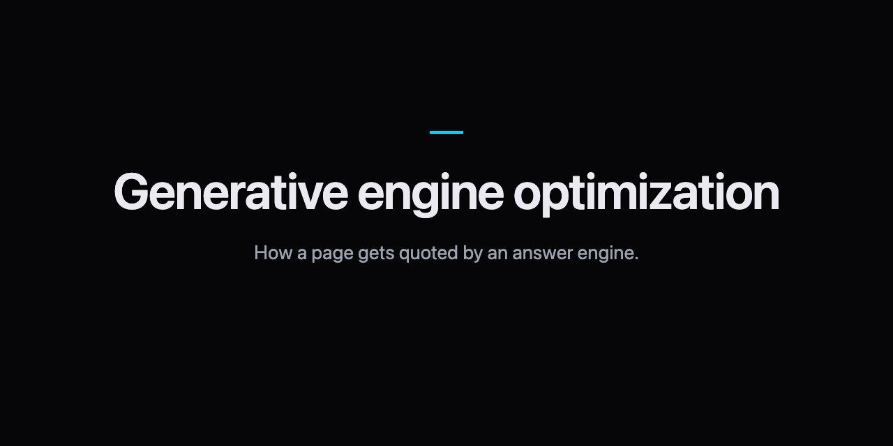
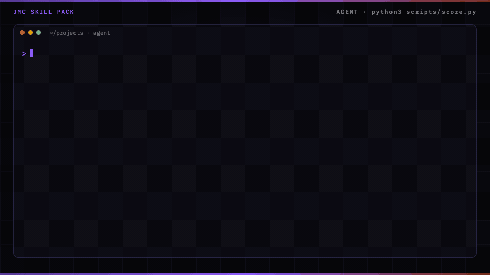

<p align="center">
  
</p>

# Generative engine optimization skill for Claude Code

Generative engine optimization is how a page gets quoted by an answer engine.

## In 60 seconds

```text
/plugin marketplace add cmj-hub/gtm-operator-skills
/plugin install geo@gtm-operator-skills
/geo:geo
```

Or score the sample without an agent:

```bash
python3 scripts/score.py --file examples/findability-good.json       # exit 0, prints six lines, then "Next: /landing-page:page"
python3 scripts/score.py --file examples/findability-calendar.json   # exit 1: - a 40-article calendar → write one brief per buyer question; run other questions as separate experiments
```

Part of the GTM operator suite — `/plugin install gtm@gtm-operator-skills` installs all ten.

Add the [gtm-operator mod](https://github.com/cmj-hub/gtm-operator-claude-mod) to see the suite's next step above your prompt and keep `brand-config.json` from being overwritten: `/plugin install gtm-operator@gtm-operator-skills`.

Answer engine optimization is the same check.

On 2026-10-01, three clean runs of the buyer question in ChatGPT named a rival and a roundup. This brand was named or cited in 0 of 3. Each run is recorded with its query, cited URLs, and a saved answer.

The good draft passes. A 40-article calendar fails the score.

<p align="center">
  
</p>

The build guide teaches a human. The pack teaches an agent.

## Install

In Claude Code, add this repository as a plugin marketplace and install the pack:

```
/plugin marketplace add cmj-hub/claude-geo
/plugin install geo@jmc-geo
```

Or clone it and load the files from disk. The one skill lives in `skills/geo/`; its modes are in `skills/geo/modes/`.

```
git clone https://github.com/cmj-hub/claude-geo.git
```

Other agents (Codex, Cursor, and the rest) can install it with the skills CLI:

```
npx skills add cmj-hub/claude-geo --all -g --full-depth
```

The scorer is Python in this repo. It does not call a paid API.

## The modes

One command, `/geo:geo`, with a mode as the argument. Run the modes in order. Each one writes one field of `gtm/findability.json`. That file is one experiment: one buyer question. Further questions run in parallel, one file each under `gtm/findability/`. With no argument, `/geo:geo` reports status and starts the first missing field.

| Command | Writes | Job |
|---|---|---|
| `/geo:geo channel-decision` | `channel_decision` | Whether search is a channel for this offer, and what comes first |
| `/geo:geo buyer-question` | `buyer_question` | One question, in the buyer's words, close to a decision |
| `/geo:geo citation-record` | `citation_record` | Who an answer engine named, on one date, by one method |
| `/geo:geo indexability` | `indexability_pass` | Status, robots for search and AI crawlers, sitemap, raw HTML |
| `/geo:geo brief` | `brief`, `kill_date` | One quotable page, and the date the record is run again |
| `/geo:geo review` | `review` | On the kill date: rerun the record, add search and business evidence, then expand, revise, or stop |
| `/geo:geo status` | nothing | What passes, what fails, and the next step |

Moved in 0.6: `/geo:brief` is now `/geo:geo brief`, and the same for every former step command.

## What you walk out with in 15 minutes

Artifact: `examples/findability-good.json`.

```bash
python3 scripts/score.py --file examples/findability-good.json
python3 scripts/score.py --file examples/findability-weak.json
python3 scripts/score.py --file examples/findability-calendar.json
```

The good draft exits 0, prints the six lines, and names the next step. `examples/findability-reviewed.json` adds a kill-date review and exits 0 with `Next: /geo:geo buyer-question`. The weak draft exits 1 and prints one `- axis: what is wrong → what to change` line per problem. The calendar draft exits 1. Then copy `examples/findability-template.json` to `gtm/findability.json` and drop in yours. Add `--json` for one JSON object an agent can read (`pass`, `problems` with a `fix` each, `next`).

## What the score checks

| Axis | Fails when |
|---|---|
| channel decision | One line with no reason and no first step |
| buyer question | Not a question, more than one question, a keyword list, or our question instead of the buyer's |
| citation record | Free text instead of runs; a run's query is not the buyer question word for word or names the brand; fewer than three distinct runs per engine and method; no saved evidence file or URL; not a clean session; `brand_status` contradicts the brands named or the cited URLs; runs span more than a week |
| indexability pass | Free text; status is not exactly 200; more than one redirect; Googlebot or Bingbot not recorded; a search or AI-search crawler blocked; noindex; not in the sitemap; answer missing from raw HTML |
| brief | Free text; no page; summary under 8 or over 150 words; no unique claim, or a claim with no number or name in it; no follow-up questions |
| kill date | Not a date, or outside 14 to 180 days after the first run |
| review (optional) | Rerun skips an engine or method from the baseline; citations are the only evidence; `stop` on a page that is not indexed, or that has qualified visits or conversions |

Placeholders such as `TBD`, `Unchecked`, or `None observed` fail on any axis.

## What a pass means

A pass means the record is complete and internally consistent: the runs happened as the protocol says, the evidence exists on disk, the URL could be fetched on the day it was checked, and the brief names a specific claim. It does not mean the page is indexed, cited, or effective. The scorer cannot tell a claim only you can make from one a rival could also make. The review on the kill date measures outcomes.

## What this pack will not do

It will not publish a health-score dump. It does not start an llms.txt project. It will not fill a 40-article calendar, or any batch of ten or more posts. It will run several independent buyer questions side by side, one experiment file each.

## The data step this pack leaves to you

This pack scores one findability experiment: buyer question, citation record, indexability, brief. Live reads of how answer engines name your brand sit outside the pack.

Run [How AI answers mention your brand](https://thegtmdirectory.com/jobs/how-ai-answers-mention-your-brand) on The Growth Desk when you need dated citation evidence for the buyer question you scored here.

## What is answer engine optimization?

The same job. A page gets quoted by an answer engine, or it does not. This pack scores that check.

## Does this write the content calendar?

No. A 40-article calendar fails the score. A brief that says "no content calendar" does not: refusals skip a clause that rejects the term.

## Which answer engines does it cover?

The citation record works for any engine a buyer uses: ChatGPT, Perplexity, Claude, Gemini, Copilot, Google AI Overviews and AI Mode. The indexability pass checks robots.txt for the crawlers behind them.

## Does it need llms.txt?

No. llms.txt is not a fetchability control, and no major answer engine has committed to read it. Robots, status, sitemap, and raw HTML decide whether a page can be fetched.

## On the site

- [Generative engine optimization pack](https://jaymountconsulting.com/skills/claude-geo) — this pack's page
- [Skill packs catalog](https://jaymountconsulting.com/skills) — install paths + every pack

## Free, no signup

[AI search visibility checker](https://jaymountconsulting.com/tools/geo-visibility-audit)

## Free, by email

[**Growth Audit**](https://jaymountconsulting.com/growth-audit) — architecture gaps in the GTM you already run. Free written report.

[**Friday Signal**](https://jaymountconsulting.com/newsletter/signal) — one Friday GTM read. No pitch in it.
## Privacy and security

`scripts/score.py` is standard-library Python and opens no network connection. It reads only the draft JSON you give it, and checks that each evidence path in it exists, without opening the file. The skill writes drafts under `gtm/` (`gtm/findability.json`, one file per further experiment, and saved answers in `gtm/evidence/`) in your project folder and only reads `brand-config.json`. The `indexability` mode runs read-only `curl` against the URL you name, and the `citation-record` mode runs your question in an answer engine or asks you to paste the answer; your agent asks before each request. No telemetry, no credentials, nothing published. See [SECURITY.md](SECURITY.md).

## Next

Previous: [Landing page](https://github.com/cmj-hub/claude-landing-page)

Next: [LinkedIn posts](https://github.com/cmj-hub/claude-founder-brand)

## License

MIT. Python 3 standard library only. No network.
